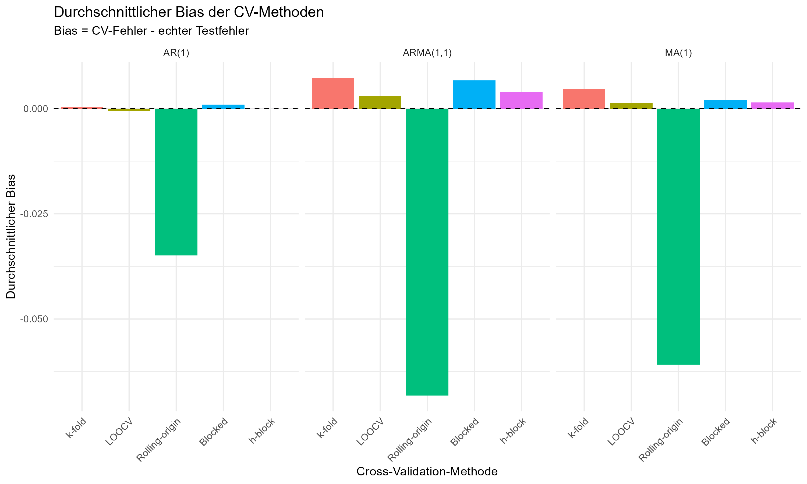
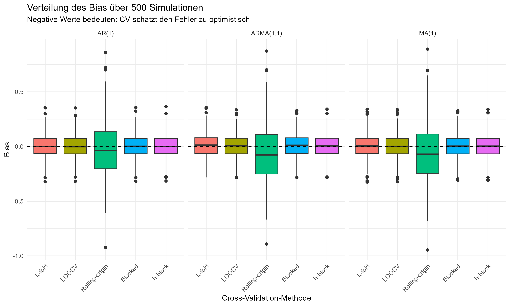
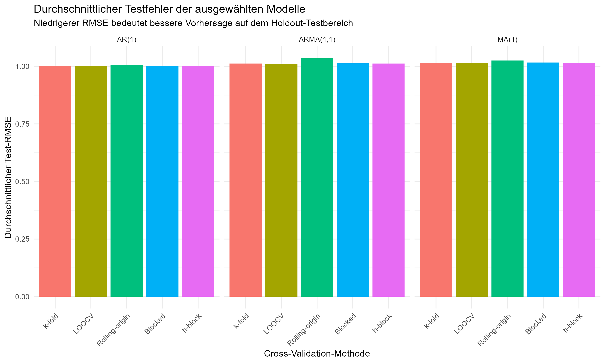
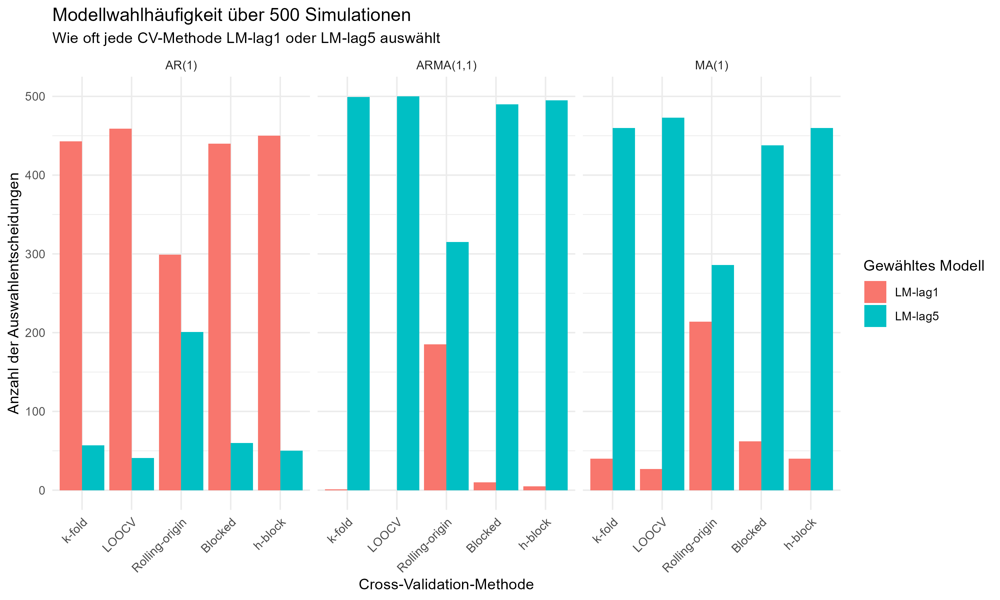

```{r}
#| label: setup
library(knitr)

summary_table <- read.csv("results/tables/summary_table_final.csv")
bias_sd_table <- read.csv("results/tables/bias_sd_table_final.csv")
model_selection_table <- read.csv("results/tables/model_selection_table_final.csv")
best_bias_table <- read.csv("results/tables/best_bias_table_final.csv")
```

# Introduction

Cross-validation is a standard tool for estimating prediction error and selecting models in statistical learning. In time series forecasting, however, the observations are ordered and often serially dependent. This makes the direct transfer of standard cross-validation methods problematic, because random splits can mix past and future information.

This project studies **Time Series Cross-Validation for Temporal Data**. The goal is to compare several cross-validation methods in a controlled simulation setting and to evaluate how accurately they estimate the hold-out forecasting error.

The main research question is:

> Which cross-validation method provides the most reliable error estimates and model choices for forecasting models on temporally dependent data?

# Methodology

We compare five cross-validation methods:

- **k-fold CV**, used as a classical benchmark.
- **LOOCV**, where each observation is left out once.
- **Rolling-origin CV**, where training data precede validation data in time.
- **Blocked CV**, where temporally contiguous blocks are used for validation.
- **h-block CV**, where a gap is left between training and validation observations.

The forecasting task is based on lagged values of the simulated time series. Two linear forecasting models are compared:

- **LM-lag1**: linear model using one lag.
- **LM-lag5**: linear model using five lags.

For each simulated time series, the cross-validation methods estimate the prediction error of the candidate models. The model with the lowest estimated CV error is selected and compared against the performance on a temporally ordered hold-out test set.

# Simulation Design

The simulation uses three data-generating processes (DGPs):

- **AR(1)**: autoregressive process of order 1.
- **MA(1)**: moving-average process of order 1.
- **ARMA(1,1)**: process combining autoregressive and moving-average components.

For each DGP, we conducted **500 Monte-Carlo repetitions**. In each repetition, the following steps were performed:

1. Simulate a time series from the selected DGP.
2. Create lagged predictors for the forecasting models.
3. Split the series into a training part and a temporally later hold-out test part.
4. Estimate the CV error for each method and model combination.
5. Select the best model according to each CV method.
6. Evaluate the selected model on the hold-out test set.
7. Store CV error, test error, bias, model selection decision, and runtime-relevant outputs.

The key evaluation quantity is the bias of the CV error estimate:

$$
\text{Bias} = \widehat{Err}_{CV} - Err_{test}.
$$

A bias close to zero indicates that the CV method estimates the hold-out test error accurately. Negative bias means that the CV method underestimates the true test error.

# Results

## Summary of CV and Test Errors

```{r}
#| label: tbl-summary
#| tbl-cap: "Mean CV RMSE, mean test RMSE, and bias by DGP and CV method."
kable(summary_table, digits = 4)
```

The summary table shows that the average bias differs substantially across CV methods. Across the considered DGPs, **h-block CV** and **LOOCV** are often closest to a bias of zero. In contrast, **rolling-origin CV** shows a noticeably stronger negative bias in this specific simulation setup.

For the AR(1) process, h-block CV has the smallest absolute bias. For ARMA(1,1), LOOCV is closest to zero. For MA(1), both h-block CV and LOOCV are essentially tied with the smallest absolute bias.

## Bias Variability

```{r}
#| label: tbl-bias-sd
#| tbl-cap: "Standard deviation of bias by DGP and CV method."
kable(bias_sd_table, digits = 4)
```

The bias standard deviations indicate that rolling-origin CV has a substantially higher bias variability than the other methods in all three DGPs. This suggests that, in the current setup, rolling-origin CV is less stable as an error estimator.

## Best Methods by Absolute Bias

```{r}
#| label: tbl-best-bias
#| tbl-cap: "CV methods with the smallest absolute bias by DGP."
kable(best_bias_table, digits = 4)
```

The best-bias table summarizes which methods are closest to unbiased error estimation. h-block CV performs particularly well for AR(1) and MA(1), while LOOCV performs best for ARMA(1,1) and ties with h-block CV for MA(1).

## Model Selection

```{r}
#| label: tbl-model-selection
#| tbl-cap: "Model selection frequencies by DGP and CV method."
kable(model_selection_table, digits = 2)
```

The model selection results show that the preferred model depends strongly on the DGP and CV method. For AR(1), most methods select **LM-lag1** in the majority of repetitions. For MA(1) and ARMA(1,1), most methods more frequently select **LM-lag5**. h-block CV produces a more balanced selection pattern than the other methods, especially for AR(1) and MA(1).

## Figures









# Discussion

The results suggest that **h-block CV** and **LOOCV** provide the most accurate bias behavior in several of the simulated settings. Their mean bias values are close to zero, meaning that their CV error estimates are close to the corresponding hold-out test errors.

The strongest pattern concerns **rolling-origin CV**. In this concrete setup, rolling-origin CV shows a stronger negative bias for all three DGPs. This means that it tends to underestimate the hold-out test error. In addition, the bias standard deviation is higher for rolling-origin CV than for the other methods, indicating less stable error estimates across Monte-Carlo repetitions.

This result should not be interpreted as a general rejection of rolling-origin CV. Rolling-origin CV is theoretically well suited for forecasting because it respects the temporal ordering of the data. However, its empirical performance depends strongly on implementation choices such as:

- forecast horizon,
- step size,
- size of the initial training window,
- size and number of validation windows,
- whether the training window is expanding or rolling.

Therefore, the negative bias observed here should be understood as a result of this specific simulation design and not as a universal property of rolling-origin cross-validation.

The comparison also shows that model selection behavior differs by DGP. For AR(1), the simpler one-lag model is usually selected. For MA(1) and ARMA(1,1), the five-lag model is selected more often, which may reflect that additional lagged predictors help approximate more complex dependence structures.

# Limitations

This project has several limitations:

- Only three DGPs were studied: AR(1), MA(1), and ARMA(1,1).
- Only two forecasting models were compared: LM-lag1 and LM-lag5.
- The simulation uses one concrete setup for sample size, train-test split, and CV configuration.
- Rolling-origin CV is sensitive to design choices, so alternative horizons, step sizes, and validation windows may lead to different results.
- The study focuses on simulated data; real-world time series may include structural breaks, outliers, nonstationarity, or more complex seasonal patterns.

# Conclusion

In this Monte-Carlo study, h-block CV and LOOCV often produce CV error estimates closest to the hold-out test error. Rolling-origin CV shows a stronger negative bias and higher bias variability in the current setup.

The main conclusion is therefore cautious: for the simulated DGPs and model classes considered here, h-block CV and LOOCV appear reliable in terms of bias, while rolling-origin CV requires careful tuning of its design parameters. Future work should test additional DGPs, more flexible forecasting models, and alternative rolling-origin configurations.
