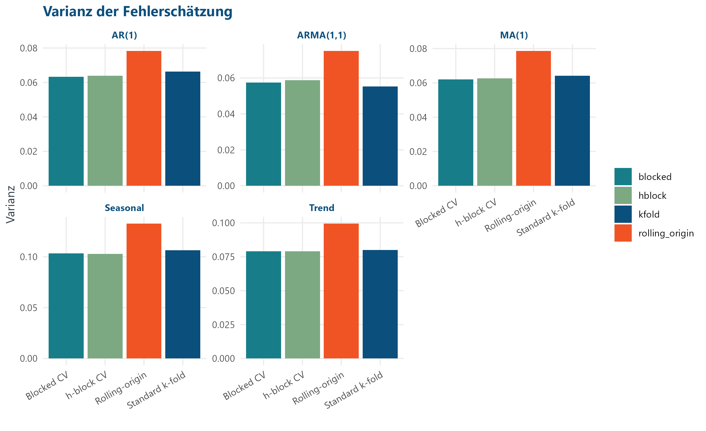

```{r}
if (dir.exists(".r-lib")) {
  .libPaths(c(normalizePath(".r-lib"), .libPaths()))
}
summary_table <- read.csv("../output/cv_comparison/tables/cv_method_summary.csv")
ranking <- read.csv("../output/cv_comparison/tables/cv_method_ranking.csv")
case_metrics <- read.csv("../output/final_comparison/model_comparison_metrics.csv")
```

## Motivation

Zeitreihen sind geordnet.

Zufällige Cross-Validation kann diese Ordnung verletzen.

<p class="accent">Die zentrale Frage ist, wie gut CV den zukünftigen Prognosefehler schätzt.</p>

## Forschungsfrage

> Wie unterscheiden sich Standard-k-fold-Cross-Validation, blocked Cross-Validation, h-block Cross-Validation und rolling-origin Cross-Validation bei AR-, MA-, ARMA-, Trend- und saisonalen Zeitreihen hinsichtlich der Schätzung des zukünftigen Prognosefehlers?

## Fünf Zeitreihenstrukturen

| DGP | Parameter | Struktur |
|---|---:|---|
| AR(1) | phi = 0,7 | direkter Vorwert |
| MA(1) | theta = 0,6 | kurzfristiger Schock |
| ARMA(1,1) | phi = 0,6; theta = 0,5 | Wert und Schock |
| Trend | beta1 = 0,03 | nichtstationäre Entwicklung |
| Seasonal | Periode 12 | regelmäßige Saison |

## Gemeinsames Modell

Für alle DGPs und CV-Verfahren wird dasselbe Modell genutzt:

\[
y_t \sim lag_1 + lag_2 + lag_3 + lag_4 + lag_5
\]

Das Modell ist nicht für jeden DGP optimal. Es hält aber den Modellteil konstant, damit der Unterschied stärker auf die CV-Methode zurückgeführt werden kann.

## Train-Test-Design

| Teil | Zeitpunkte | Umfang |
|---|---:|---:|
| Training | 31 bis 184 | 154 |
| Test | 185 bis 250 | 66 |

Der Testzeitraum liegt vollständig nach dem Training und wird nicht für die CV verwendet.

## Vier CV-Verfahren

| Verfahren | Idee | Problem |
|---|---|---|
| k-fold | zufällige Folds | Zeitrichtung ignoriert |
| blocked | zusammenhängende Blöcke | spätere Trainingswerte möglich |
| h-block | Block plus Puffer `h = 5` | nicht vollständig zeitgerichtet |
| rolling-origin | expandierendes Trainingsfenster | weniger/variablere Validierung |

## Monte-Carlo-Design

| Element | Wert |
|---|---:|
| DGPs | 5 |
| Wiederholungen je DGP | 200 |
| CV-Methoden | 4 |
| Ergebniszeilen | 4.000 |
| Pilotlauf | 5 Wiederholungen je DGP |

Alle CV-Methoden erhalten innerhalb einer Simulation dieselbe Zeitreihe.

## Bewertungslogik

\[
\text{estimation error} = \text{CV-MSE} - \text{Test-MSE}
\]

- negativ: optimistische Schätzung
- positiv: pessimistische Schätzung
- nahe null: CV-MSE liegt nah am Test-MSE

Bias allein reicht nicht aus; RMSE und Varianz zeigen zusätzlich die Stabilität.

## Bias-Ergebnisse

{width="88%"}

## RMSE der Fehlerschätzung

{width="88%"}

## Varianz der Schätzfehler

{width="88%"}

## Ergebnisrangfolge

```{r}
knitr::kable(ranking)
```

## Interpretation

- AR(1): rolling-origin beim Bias stark, blocked bei RMSE und Varianz.
- ARMA(1,1): k-fold liegt numerisch vorn, bleibt aber zeitlich kritisch.
- MA(1): blocked schneidet in den drei Genauigkeitskriterien am besten ab.
- Seasonal: blocked beim Bias, h-block bei RMSE und Varianz.
- Trend: rolling-origin beim Bias, h-block beim RMSE.

## Zusätzliche ARMA-Fallstudie

```{r}
case_display <- case_metrics[, c("model", "test_rmse", "test_mae")]
knitr::kable(case_display)
```

Lasso erzielt in dieser konkreten Fallstudie den kleinsten Testfehler. Das ist kein allgemeiner Beweis, dass Lasso immer überlegen ist.

## Limitationen

- simulierte, einfache DGPs
- lineares Modell mit `lag_1` bis `lag_5`
- saisonale Periode 12, aber kein `lag_12` im Hauptmodell
- rolling-origin nutzt weniger Validierungspunkte
- Ridge/Lasso nur als Zusatzfallstudie

## Fazit

Es gibt keine universell beste CV-Methode für Zeitreihen.

<p class="closing-statement">Die passende Methode hängt davon ab, ob Zeitrichtung, Bias, Streuung oder praktische Rechenzeit im konkreten Prognoseproblem wichtiger sind.</p>

<!--
Sprechplan für die Gruppenpräsentation:

Niklas:
- Motivation
- Forschungsfrage
- gemeinsames Modell
- Train-Test-Design

Alex:
- fünf DGPs
- vier CV-Verfahren
- Monte-Carlo-Design
- Bewertungslogik

Nils:
- zentrale Ergebnisse
- Ridge-/Lasso-Fallstudie
- Limitationen
- Fazit

Die Aufteilung ist so gedacht, dass jede Person mehrere inhaltliche Folien übernimmt und keine einzelne Person als Hauptsprecher auftritt.
-->