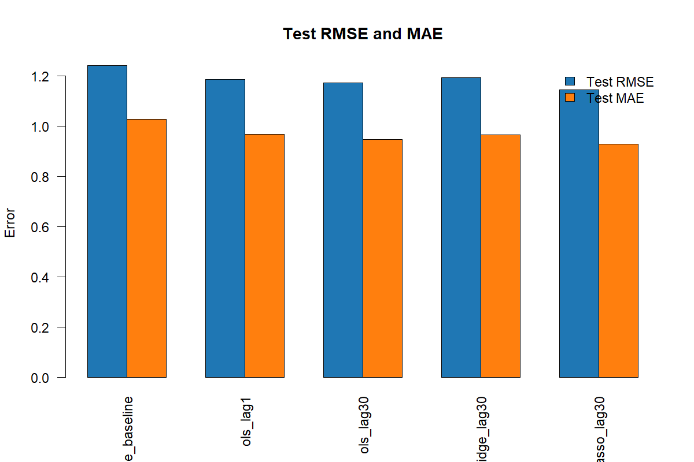
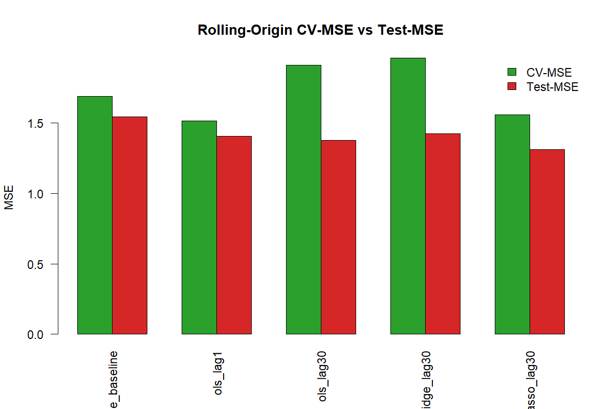
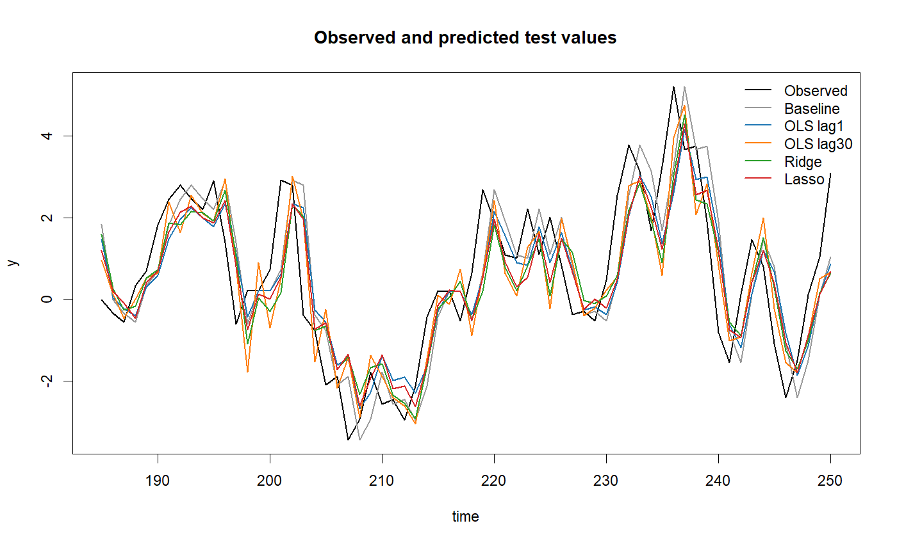
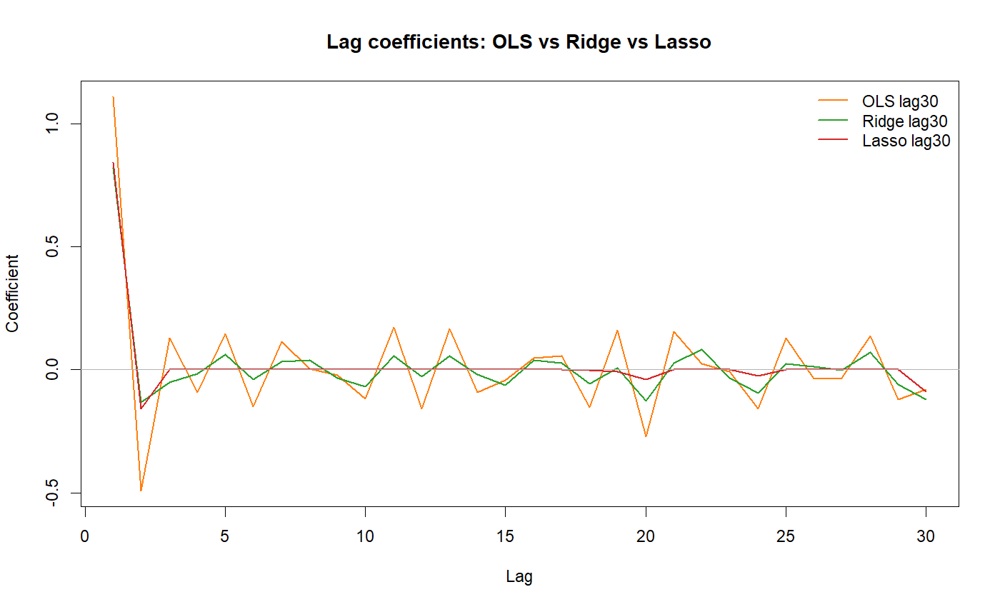
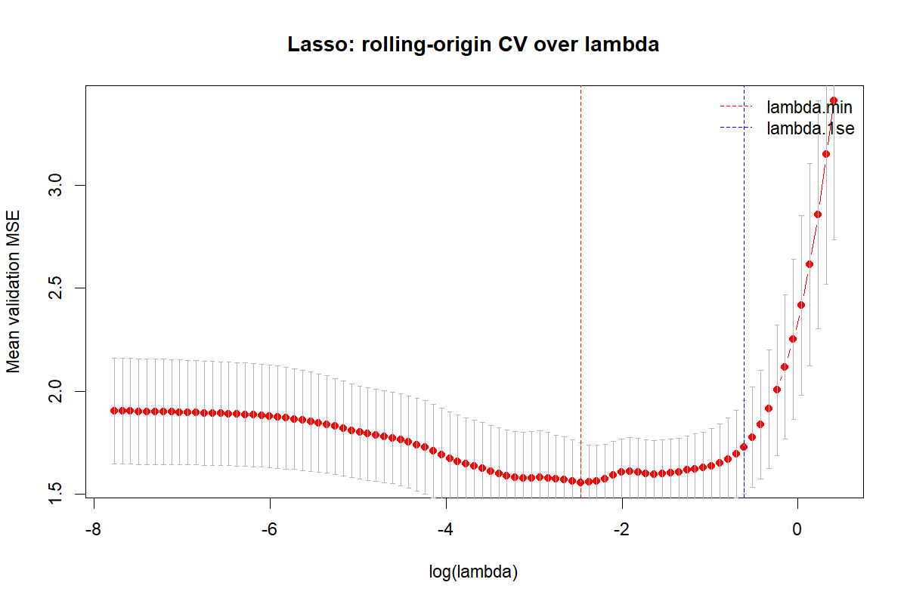

```{r}
#| label: setup
#| include: false
required_report_packages <- c("here", "knitr")
missing_report_packages <- required_report_packages[
  !vapply(required_report_packages, requireNamespace, logical(1), quietly = TRUE)
]
if (length(missing_report_packages) > 0) {
  stop("Fehlende Pakete für den Bericht: ", paste(missing_report_packages, collapse = ", "))
}

metrics <- read.csv(here::here(
  "results", "final_comparison", "model_comparison_metrics.csv"
))
splits <- read.csv(here::here(
  "results", "final_comparison", "tables", "final_comparison_time_cv_splits.csv"
))
coefficients <- read.csv(here::here(
  "results", "final_comparison", "tables", "model_coefficients_lag1_to_lag30.csv"
))
selected_lags <- read.csv(here::here(
  "results", "lasso", "tables", "lasso_selected_lags.csv"
))
checks <- read.csv(here::here(
  "results", "final_comparison", "tables", "final_model_comparison_checks.csv"
))

model_labels <- c(
  naive_baseline = "Naive Baseline",
  ols_lag1 = "OLS Lag 1",
  ols_lag30 = "OLS Lag 30",
  ridge_lag30 = "Ridge Lag 30",
  lasso_lag30 = "Lasso Lag 30"
)
metrics$model_label <- unname(model_labels[metrics$model])

best_rmse <- metrics[which.min(metrics$test_rmse), ]
best_mae <- metrics[which.min(metrics$test_mae), ]
ols30_rmse <- metrics$test_rmse[metrics$model == "ols_lag30"]
lasso_rmse <- metrics$test_rmse[metrics$model == "lasso_lag30"]
lasso_improvement_pct <- 100 * (ols30_rmse - lasso_rmse) / ols30_rmse
```

# Projekt in Kürze

Für eine simulierte ARMA(1,1)-Zeitreihe mit (T=250) wurden fünf Prognosemodelle auf denselben 154 Trainings- und 66 Testbeobachtungen verglichen. Die Regularisierungsparameter von Ridge und Lasso wurden ausschließlich innerhalb des Trainingszeitraums durch fünf zeitgerichtete Rolling-Origin-Splits bestimmt. Der unabhängige Testzeitraum von 185 bis 250 blieb bis zur finalen Evaluation unberührt.

Lasso erreicht mit einem Test-RMSE von `r sprintf("%.4f", best_rmse$test_rmse)` und einem Test-MAE von `r sprintf("%.4f", best_mae$test_mae)` die besten Testwerte. Es verwendet 7 von 30 Lags. Gegenüber OLS mit 30 Lags sinkt der RMSE um `r sprintf("%.4f", ols30_rmse - lasso_rmse)` beziehungsweise rund `r sprintf("%.1f", lasso_improvement_pct)` Prozent. Der Vorteil ist damit real vorhanden, aber nicht groß. Gleichzeitig hat OLS Lag 1 den kleinsten Rolling-Origin-CV-MSE. Die Validierung schätzt die relative Rangfolge auf dem späteren Testzeitraum also nicht vollständig korrekt.

::: {.callout-note}
Der Bericht berechnet keine Modelle neu. `R/99_run_all.R` erzeugt und prüft die gespeicherten Resultate; dieses Quarto-Dokument liest anschließend nur die finalen Tabellen und Grafiken ein. Analyse und Darstellung bleiben dadurch klar getrennt.
:::

# Einleitung

Zeitreihen unterscheiden sich von klassischen tabellarischen Daten durch ihre feste Reihenfolge. Beobachtungen, die nah beieinanderliegen, sind häufig voneinander abhängig. Bei Prognosen ist außerdem die Richtung eindeutig: Vergangene Werte dürfen zur Vorhersage zukünftiger Werte verwendet werden, zukünftige Werte aber nicht zur Erklärung der Vergangenheit.

Diese Eigenschaft macht eine zufällige Cross-Validation problematisch. Wenn spätere Beobachtungen im Training eines früheren Validierungsblocks landen, entsteht Data Leakage. Der geschätzte Fehler beschreibt dann nicht mehr die tatsächliche Prognosesituation. Das Projekt untersucht deshalb einen vollständig zeitgerichteten Modellvergleich und legt besonderen Wert auf eine nachvollziehbare Lambda-Auswahl für Ridge und Lasso.

# Forschungsfrage

> Wie gut prognostizieren OLS, Ridge und Lasso eine ARMA(1,1)-Zeitreihe mit bis zu 30 verzögerten Prädiktoren, und wie zuverlässig schätzt Rolling-Origin-Cross-Validation den späteren Testfehler?

Die Forschungsfrage hat zwei Teile. Erstens wird die Testgüte der Modelle verglichen. Zweitens wird geprüft, wie nah der innerhalb der Trainingsdaten geschätzte CV-MSE am späteren Test-MSE liegt.

# Datengenerierender Prozess

Die finale Modellanalyse verwendet einen stationären ARMA(1,1)-Prozess:

$$
y_t = \phi y_{t-1} + \varepsilon_t + \theta \varepsilon_{t-1},
\qquad \varepsilon_t \sim \mathcal{N}(0,\sigma^2).
$$

Im Projekt gelten (phi=0{,}6), (	heta=0{,}5), (sigma=1) und (T=250). Der feste Seed `20260716` sorgt dafür, dass der Datensatz bei vollständigen Wiederholungsläufen identisch erzeugt wird.

Der folgende Ausschnitt stammt aus `R/01_simulate_dgp.R`:

```{r}
#| eval: false
simulate_arma11 <- function(T = 250, phi = 0.6, theta = 0.5, sigma = 1) {
  epsilon <- rnorm(T, mean = 0, sd = sigma)
  y <- numeric(T)
  y[1] <- epsilon[1]

  for (i in 2:T) {
    y[i] <- phi * y[i - 1] + epsilon[i] + theta * epsilon[i - 1]
  }
  y
}
```

Die Simulation ist bewusst kontrolliert: Die wahre zeitliche Struktur ist bekannt, während die Prognosemodelle nur die erzeugten Lag-Variablen sehen.

# Konstruktion der Lag-Prädiktoren

Für jeden Zeitpunkt (t) werden die vergangenen Werte (y_{t-1},\ldots,y_{t-30}) als Prädiktoren angelegt. Vor der Lag-Erzeugung bleibt die Reihe zeitlich sortiert. Erst danach werden genau die ersten 30 Zeilen entfernt, in denen wegen der Verschiebung mindestens ein Lag fehlt.

```{r}
#| eval: false
for (lag in 1:max_lag) {
  data[[paste0("lag_", lag)]] <- c(
    rep(NA, lag),
    y[1:(length(y) - lag)]
  )
}
data <- na.omit(data)
```

Damit beginnt der modellierbare Datensatz bei `time = 31`. Alle Modelle greifen auf dieselben Zeilen zurück; Unterschiede in den Fehlermaßen können daher nicht durch unterschiedliche Stichproben erklärt werden.

# Zeitlicher Train-Test-Split

Die 220 nach der Lag-Erzeugung verbleibenden Beobachtungen werden nicht zufällig gemischt:

| Bereich | Zeitpunkte | Beobachtungen | Zweck |
|---|---:|---:|---|
| Training | 31--184 | 154 | Modellschätzung und interne Cross-Validation |
| Test | 185--250 | 66 | einmalige finale Evaluation |

```{r}
#| eval: false
train_data <- data_lagged[data_lagged$time >= 31 & data_lagged$time <= 184, ]
test_data  <- data_lagged[data_lagged$time >= 185 & data_lagged$time <= 250, ]
```

Der Testzeitraum wird weder zur Variablenauswahl noch zur Bestimmung von `lambda` verwendet. Er spielt dieselbe Rolle wie zukünftige, zum Zeitpunkt der Modellentwicklung unbekannte Beobachtungen.

# Warum zufällige Cross-Validation problematisch ist

Bei gewöhnlicher k-fold-Cross-Validation werden die Daten in Folds aufgeteilt und jeweils alle übrigen Folds als Training verwendet. Selbst wenn die Folds intern zusammenhängende Zeitblöcke sind, kann ein früher Validierungsblock dadurch mit späteren Beobachtungen trainiert werden. Eine reine blockierte `foldid`-Variable in `cv.glmnet()` garantiert deshalb noch keine zeitgerichtete Validierung.

Das Problem wurde im Projekt erkannt und korrigiert. Die erste Lasso-Version nutzte zusammenhängende `foldid`-Blöcke, ließ aber prinzipiell zukünftige Trainingswerte zu. Die finale Implementierung verwendet eine eigene Forward-Validation-Schleife, in der für jeden Split explizit geprüft wird:

```{r}
#| eval: false
if (max(train_index) >= min(validation_index)) {
  stop("Rolling-Origin-Split verletzt die Zeitrichtung.")
}
```

Diese Bedingung schließt zukünftige Beobachtungen im Training eines früheren Validierungsblocks aus.

# Rolling-Origin-Cross-Validation

Die finale Validierung verwendet ein expandierendes Trainingsfenster. Der erste Validierungsblock folgt direkt auf das initiale Training. Nach jedem Split wird der gerade validierte Block in das nächste Trainingsfenster aufgenommen.

```{r}
#| label: tbl-splits
#| tbl-cap: "Finale lückenlose Rolling-Origin-Splits innerhalb des Trainingszeitraums."
knitr::kable(splits, align = c("c", "r", "r", "r", "r", "r", "r"))
```

Die Splits sind lückenlos: Der nächste Validierungsblock beginnt immer unmittelbar nach dem Ende des vorherigen Blocks. Die letzte Validierung endet bei `time = 184`, also direkt vor dem unabhängigen Testzeitraum.

Für Ridge und Lasso wird zunächst eine gemeinsame Lambda-Sequenz erzeugt. Anschließend wird für jeden Split ein Modell ausschließlich auf der jeweiligen Vergangenheit geschätzt. `glmnet` standardisiert dabei innerhalb jedes Trainingsfensters neu. Die Validierungsfehler werden nicht als ungewichteter Mittelwert der fünf Split-MSEs zusammengefasst, weil der letzte Block nur 13 statt 16 Beobachtungen enthält. Stattdessen verwendet das Projekt den gepoolten Fehler:

$$
\operatorname{CV-MSE}(\lambda)
=
\frac{\sum_{s=1}^{5}\operatorname{SSE}_s(\lambda)}
{\sum_{s=1}^{5} n_s}.
$$

```{r}
#| eval: false
mean_mse <- colSums(split_sse) / sum(split_n)
min_index <- which.min(mean_mse)
lambda_min <- lambda_sequence[min_index]

one_se_candidates <- which(mean_mse <= mean_mse[min_index] + se_mse[min_index])
lambda_1se <- lambda_sequence[one_se_candidates[
  which.max(lambda_sequence[one_se_candidates])
]]
```

`lambda.min` minimiert den gepoolten Validierungs-MSE und wird für das Hauptmodell verwendet. `lambda.1se` ist die stärker regularisierte Lösung innerhalb einer Standardabweichung des Minimums und wird als Robustheitswert gespeichert.

## Erkannte und korrigierte Validierungsprobleme

| Problem | Warum relevant | Finale Korrektur |
|---|---|---|
| Blockierte `foldid`-Werte in `cv.glmnet()` | Andere Folds können zeitlich nach dem Validierungsblock liegen. | Eigene Rolling-Origin-Schleife mit ausschließlich früheren Trainingswerten. |
| Lücken zwischen einzelnen Splits | Einzelne Zeitpunkte wurden direkt dem nächsten Training zugeschlagen, ohne validiert zu werden. | Jeder Trainingsendpunkt entspricht dem Ende des vorherigen Validierungsblocks. |
| Ungleiche Blockgrößen | Ein ungewichteter Mittelwert würde den letzten, kleineren Block zu stark gewichten. | Gepoolte SSE über alle 77 Validierungsvorhersagen. |
| Globale Standardisierung | Mittelwert und Streuung aus späteren Daten könnten in frühere Splits gelangen. | `standardize = TRUE` wird in jedem separat geschätzten `glmnet`-Fit angewendet. |
| Mehrfach hart codierte Parameter | Abweichende Werte zwischen Skripten wären schwer erkennbar. | Zentrale Konfiguration in `R/project_config.R`. |

# Software and R Packages

Die Paketübersicht basiert auf den tatsächlichen `library()`-, Namespace- und Funktionsaufrufen in den R-Skripten sowie auf `results/session_info.txt`. Zusätzliche Pakete wie `dplyr` oder `readr` werden nicht aufgeführt, weil sie im Projektcode nicht verwendet werden.

```{r}
#| label: tbl-packages
#| tbl-cap: "Direkt verwendete Softwarekomponenten und mögliche Alternativen."
package_table <- data.frame(
  package = c("here", "glmnet", "ggplot2", "knitr", "Base R / stats", "utils / graphics / grDevices"),
  purpose_in_project = c(
    "Relative Projektpfade",
    "Ridge- und Lasso-Regression",
    "Grafiken der Monte-Carlo-Auswertung",
    "Tabellen und Codeausgabe in Quarto",
    "Simulation, OLS, Vorhersagen und Kennzahlen",
    "CSV-Ein-/Ausgabe und finale Base-R-Grafiken"
  ),
  why_used = c(
    "Verhindert benutzerspezifische absolute Pfade.",
    "Schätzt effizient ganze Lambda-Pfade und unterstützt Ridge sowie Lasso.",
    "Erzeugt einheitliche, facettierte und gut anpassbare Ergebnisplots.",
    "Bindet R-Ergebnisse sauber in den gerenderten Bericht ein.",
    "Die benötigten statistischen Grundfunktionen sind bereits in R enthalten.",
    "Für einfache Dateien und Grafiken reichen stabile Standardfunktionen aus."
  ),
  important_functions = c(
    "here()",
    "glmnet(), predict(), coef()",
    "ggplot(), geom_col(), geom_boxplot(), facet_wrap(), ggsave()",
    "kable(), opts_chunk$set()",
    "rnorm(), lm(), predict(), mean(), sqrt()",
    "read.csv(), write.csv(), png(), plot(), lines(), barplot(), dev.off()"
  ),
  possible_alternative = c(
    "file.path() mit explizit gesetztem Projektstamm oder rprojroot",
    "Eigene Optimierung oder ein anderes Penalized-Regression-Paket",
    "Base-R-Grafikfunktionen",
    "Quarto-Markdown-Tabellen oder andere Tabellenpakete",
    "Zusätzliche Modellpakete; für OLS hier nicht notwendig",
    "readr für CSV und ggplot2 für alle Grafiken"
  ),
  check.names = FALSE
)
names(package_table) <- c(
  "Paket", "Verwendung im Projekt", "Warum verwendet",
  "Wichtige Funktionen", "Mögliche Alternative"
)
knitr::kable(package_table, align = c("l", "l", "l", "l", "l"))
```

`Matrix` erscheint in `session_info.txt`, wird im Projekt aber nicht direkt aufgerufen. Es ist eine technische Abhängigkeit von `glmnet` und wird deshalb nicht als eigenständige methodische Entscheidung dargestellt. Base R sowie die standardmäßig mit R ausgelieferten Pakete `stats`, `utils`, `graphics` und `grDevices` benötigen keine zusätzliche Installation.

Quarto ist ebenfalls kein statistisches R-Paket. Es ist das Render-System, das Text, Code, Tabellen und Abbildungen zu HTML beziehungsweise GitHub-Flavored Markdown zusammensetzt.

## `here`: relative Projektpfade

Der reale Ablauf in `R/99_run_all.R` lädt die Konfiguration und Resultate relativ zum Projektstamm:

```{r}
#| eval: false
source(here("R", "project_config.R"))
metrics <- read.csv(here(
  "results", "final_comparison", "model_comparison_metrics.csv"
))
```

Dadurch hängt der Code nicht vom Windows-Benutzernamen oder vom konkreten Speicherort des Repositories ab. Eine Alternative wäre eine Kombination aus `file.path()` und einem manuell festgelegten Projektstamm; `here` ist in diesem Projekt kürzer und weniger fehleranfällig.

## `glmnet`: Ridge und Lasso

Der folgende Ausschnitt entspricht dem finalen Lasso-Fit:

```{r}
#| eval: false
lasso_model <- glmnet::glmnet(
  x = x_train,
  y = y_train,
  alpha = 1,
  family = "gaussian",
  standardize = TRUE,
  lambda = lasso_cv$lambda_min
)
```

`alpha = 1` definiert Lasso; für Ridge wird im selben Ablauf `alpha = 0` eingesetzt. `glmnet` ist geeignet, weil es regularisierte lineare Modelle über eine Lambda-Sequenz effizient schätzt. Im Projekt wird nur die Modellschätzung aus dem Paket übernommen. Die zeitgerichtete Cross-Validation wird bewusst selbst implementiert, weil `cv.glmnet()` mit gewöhnlichen Fold-Zuweisungen keine Forward-Validation garantiert.

## `ggplot2`: Monte-Carlo-Grafiken

`R/07_plots.R` verwendet `ggplot2` für die früheren Vergleiche der fünf CV-Verfahren:

```{r}
#| eval: false
plot_bias_mean <- ggplot(
  mc_summary,
  aes(x = cv_method_label, y = bias, fill = cv_method_label)
) +
  geom_col() +
  facet_wrap(~ dgp) +
  geom_hline(yintercept = 0, linetype = "dashed") +
  theme_minimal()

ggsave(
  filename = here("results", "figures", "plot_bias_mean.png"),
  plot = plot_bias_mean,
  width = 10,
  height = 6,
  dpi = 300
)
```

Die Grammatik von `ggplot2` eignet sich besonders für wiederholte Vergleiche nach DGP und CV-Methode. Die finalen Modellvergleichsgrafiken in `R/11_final_model_comparison.R` nutzen dagegen bewusst Base-R-Grafikfunktionen. Beide Ansätze sind im tatsächlichen Projekt vorhanden.

## `knitr`: Tabellen im Quarto-Bericht

Gespeicherte CSV-Dateien werden mit Base R eingelesen und mit `knitr` dargestellt:

```{r}
#| eval: false
metrics <- read.csv(here::here(
  "results", "final_comparison", "model_comparison_metrics.csv"
))
knitr::kable(metrics, digits = 4)
```

`knitr` verbindet ausführbaren R-Code mit dem Quarto-Dokument. Es schätzt hier keine Modelle, sondern formatiert bereits gespeicherte Resultate für den Bericht.

## Base R, `stats`, `utils` und Grafikfunktionen

OLS wird mit `lm()` aus `stats` geschätzt; Vorhersagen entstehen mit `predict()`:

```{r}
#| eval: false
ols_lag30_model <- lm(make_formula("y", lag_columns), data = train_data)
ols_lag30_predictions <- as.numeric(
  predict(ols_lag30_model, newdata = test_data)
)
```

Für CSV-Dateien und finale Modellvergleichsgrafiken reichen Standardfunktionen:

```{r}
#| eval: false
write.csv(
  metrics_table,
  file.path(output_dir, "model_comparison_metrics.csv"),
  row.names = FALSE
)

png(file.path(output_figures, "01_test_rmse_mae_comparison.png"))
barplot(metric_matrix, beside = TRUE)
dev.off()
```

Diese Funktionen sind stabil, transparent und vermeiden Paketabhängigkeiten, wenn keine komplexere Datenmanipulation oder Grafikgrammatik benötigt wird.

# Modelle

## Naive Baseline

Die naive Prognose setzt (hat y_t = y_{t-1}). Sie besitzt keine geschätzten Parameter und bildet eine sinnvolle Mindestanforderung: Ein komplexeres Modell sollte die zuletzt beobachtete Ausprägung zumindest übertreffen.

## OLS mit einem Lag

$$
y_t = \beta_0 + \beta_1 y_{t-1} + u_t.
$$

Dieses Modell ist sparsam und passt zur dominanten kurzfristigen Abhängigkeit eines ARMA(1,1)-Prozesses.

## OLS mit 30 Lags

$$
y_t = \beta_0 + \sum_{j=1}^{30}\beta_j y_{t-j} + u_t.
$$

Das Modell kann längere Abhängigkeiten abbilden, schätzt aber 30 Lag-Koeffizienten aus nur 154 Trainingsbeobachtungen. Korrelationen zwischen benachbarten Lags können die Schätzung instabil machen.

## Ridge-Regression

Ridge minimiert die quadratische Fehlerfunktion mit einer (L_2)-Strafe:

$$
\min_{\beta_0,\boldsymbol\beta}
\sum_i (y_i-\beta_0-\mathbf{x}_i^\top\boldsymbol\beta)^2
+\lambda\sum_{j=1}^{30}\beta_j^2.
$$

Die Koeffizienten werden in Richtung null geschrumpft, aber normalerweise nicht exakt auf null gesetzt. Das finale Ridge-Modell verwendet `lambda.min = 0.151093`; zusätzlich wurde `lambda.1se = 0.609964` gespeichert.

## Lasso-Regression

Lasso ersetzt die quadratische Strafe durch eine (L_1)-Strafe:

$$
\min_{\beta_0,\boldsymbol\beta}
\sum_i (y_i-\beta_0-\mathbf{x}_i^\top\boldsymbol\beta)^2
+\lambda\sum_{j=1}^{30}|\beta_j|.
$$

Dadurch können einzelne Koeffizienten exakt null werden. Das finale Modell nutzt `lambda.min = 0.084473`; `lambda.1se = 0.542999` wird für einen möglichen robusteren Vergleich gespeichert. Bei `lambda.min` bleiben sieben Lags aktiv.

```{r}
#| label: tbl-selected-lags
#| tbl-cap: "Nicht-null gesetzte Lasso-Koeffizienten beim finalen lambda.min."
selected_lags_display <- selected_lags
names(selected_lags_display) <- c("Lag", "Koeffizient")
knitr::kable(selected_lags_display, digits = 4, align = c("l", "r"))
```

# Finaler Modellvergleich

Die folgende Tabelle verwendet für jedes Modell dieselben 66 Testbeobachtungen. `CV-MSE - Test-MSE` zeigt, wie stark die interne Fehlerprognose vom später beobachteten Testfehler abweicht. Positive Werte bedeuten hier eine pessimistische CV-Schätzung.

```{r}
#| label: tbl-model-comparison
#| tbl-cap: "Rolling-Origin-CV und unabhängige Testgüte auf time 185 bis 250."
comparison_table <- metrics[, c(
  "model_label", "n_predictors", "lambda_min", "lambda_1se",
  "cv_mse", "test_mse", "test_rmse", "test_mae", "cv_test_difference"
)]
names(comparison_table) <- c(
  "Modell", "Prädiktoren", "lambda.min", "lambda.1se",
  "CV-MSE", "Test-MSE", "Test-RMSE", "Test-MAE", "CV minus Test"
)
knitr::kable(comparison_table, digits = 4, align = c("l", rep("r", 8)), na = "--")
```

Lasso hat den niedrigsten Test-RMSE und Test-MAE. OLS Lag 1 besitzt dagegen den niedrigsten CV-MSE und zugleich die kleinste Differenz zwischen CV- und Test-MSE. Die interne Validierung ist für das einfache Modell am besten kalibriert, erkennt aber den kleinen späteren Vorteil von Lasso nicht vollständig.

{#fig-test-errors fig-alt="Gruppierte Balken für Test-RMSE und Test-MAE der fünf Modelle"}

Die Unterschiede sind im Verhältnis zum gesamten Fehlerniveau klein. Lasso verbessert den RMSE gegenüber OLS Lag 30 um rund `r sprintf("%.1f", lasso_improvement_pct)` Prozent. Daraus folgt keine allgemeine Überlegenheit von Lasso, sondern eine Empfehlung für genau diesen simulierten Datensatz und diese festgelegte Konfiguration.

{#fig-cv-test fig-alt="Balkenvergleich von CV-MSE und Test-MSE je Modell"}

Die Abweichung ist bei OLS Lag 1 mit etwa 0.109 am kleinsten. Bei OLS Lag 30 und Ridge liegt sie über 0.53. Die CV-Fehler sind deshalb besser als konservative Orientierung denn als punktgenaue Vorhersage des späteren MSE zu verstehen.

{#fig-predictions fig-alt="Zeitverlauf der beobachteten und von fünf Modellen prognostizierten Testwerte"}

Die Kurven liegen häufig nah beieinander. Der Vorteil von Lasso entsteht nicht durch grundsätzlich andere Prognosen, sondern durch etwas stabilere Fehler über die 66 Testzeitpunkte.

{#fig-coefficients fig-alt="Linienvergleich der 30 Lag-Koeffizienten von OLS, Ridge und Lasso"}

Bei allen Modellen dominiert `lag_1`. Ridge verteilt kleine Effekte auf alle 30 Lags. Lasso behält vor allem `lag_1`, `lag_2` und `lag_30`; die übrigen nicht-null Koeffizienten sind deutlich kleiner.

{#fig-lasso-cv fig-alt="Lasso-CV-Fehlerkurve über log Lambda mit lambda min und lambda 1se"}

Die Fehlerkurve ist rund um das Minimum relativ flach. Das spricht dafür, kleine Unterschiede zwischen benachbarten Lambda-Werten nicht zu stark zu interpretieren. `lambda.1se` bleibt deshalb als konservativere Alternative gespeichert, obwohl der finale Vergleich wie festgelegt `lambda.min` nutzt.

# Interpretation

Der naive Ansatz wird von allen geschätzten Regressionsmodellen übertroffen. Zusätzliche Lags helfen gegenüber OLS Lag 1 nur leicht: OLS Lag 30 verbessert den Test-RMSE von 1.1852 auf 1.1730. Ohne Regularisierung erkauft das Modell diesen kleinen Vorteil mit 29 zusätzlichen Koeffizienten.

Ridge verbessert OLS Lag 30 in diesem Lauf nicht. Sein Test-RMSE von 1.1941 liegt sogar leicht darüber. Lasso erzielt dagegen mit 1.1451 den niedrigsten Test-RMSE und reduziert das Modell auf sieben aktive Lags. Diese Kombination aus etwas besserer Testgüte und sparsamerer Struktur begründet die Empfehlung für Lasso.

Die Empfehlung bleibt vorsichtig. OLS Lag 1 hat mit 1.5136 den niedrigsten CV-MSE, während Lasso bei 1.5572 liegt. Hätte die Auswahl ausschließlich den CV-MSE betrachtet, wäre das einfachere OLS-Modell gewählt worden. Der unabhängige Test bevorzugt dagegen Lasso. Das ist ein konkretes Beispiel dafür, dass Cross-Validation selbst bei korrekter Zeitrichtung eine fehlerbehaftete Schätzung bleibt.

# Limitationen und Unsicherheit

- Die finale Modellanalyse basiert auf einer einzigen simulierten ARMA(1,1)-Reihe. Sie misst keine durchschnittliche Überlegenheit über viele neue Reihen.
- Die Parameter (phi=0{,}6) und (	heta=0{,}5), die Reihenlänge und der feste Split definieren ein konkretes Szenario.
- Die fünf Rolling-Origin-Blöcke liefern nur 77 interne Validierungsvorhersagen. Die geschätzte Modellrangfolge kann daher schwanken.
- Der Testzeitraum umfasst 66 Beobachtungen. Kleine RMSE-Unterschiede können zufallsbedingt sein und werden nicht inferenzstatistisch abgesichert.
- Nur lineare Lag-Modelle und die naive Baseline werden im finalen Vergleich betrachtet.
- `lambda.1se` wird gespeichert, aber nicht als zweites Hauptmodell im finalen Vergleich ausgewertet.
- Die Ergebnisse zeigen Prognosegüte in einer Simulation; sie belegen keine kausalen Beziehungen.

# Robustheits- und Reproduzierbarkeitschecks

```{r}
#| label: tbl-checks
#| tbl-cap: "Automatische Checks aus dem finalen Modellvergleich."
checks_display <- checks
names(checks_display) <- c("Check", "Bestanden")
knitr::kable(checks_display, align = c("l", "c"))
```

Zusätzlich wurde `R/99_run_all.R` zweimal aus einer leeren R-Sitzung ausgeführt. Modellmetriken ohne die naturgemäß schwankende Laufzeit, Testvorhersagen und Lasso-Lambda-Werte waren numerisch identisch. Die Session-Information wird unter `results/session_info.txt` gespeichert.

# Fazit

Für den vorliegenden ARMA(1,1)-Datensatz ist Lasso Lag 30 das sinnvollste finale Projektmodell. Es liefert den niedrigsten Test-RMSE und Test-MAE und reduziert 30 mögliche Lags auf sieben aktive Koeffizienten. Der Gewinn gegenüber OLS Lag 30 ist moderat, nicht grundsätzlich überlegen.

Methodisch wichtiger ist die Validierungslogik: Zusammenhängende Folds allein verhindern noch kein Leakage. Erst die explizite Rolling-Origin-Konstruktion stellt sicher, dass jeder Validierungsblock ausschließlich mit seiner Vergangenheit trainiert wird. Die gepoolte Fehleraggregation und die fold-spezifische Standardisierung schließen zwei weitere stille Verzerrungsquellen aus.

# Reproduzierbarkeit

Der vollständige Analyselauf startet aus dem Projektstamm mit:

```bash
Rscript R/99_run_all.R
```

Unter der im Projekt verwendeten Windows-Installation lautet der genaue Befehl:

```powershell
& 'C:\Program Files\R\R-4.5.1\bin\Rscript.exe' R\99_run_all.R
```

Danach werden Bericht und Präsentation aus den gespeicherten Ergebnissen gerendert:

```bash
quarto render project_report.qmd
quarto render presentation.qmd
```

Die zentrale Konfiguration liegt in `R/project_config.R`: Seed `20260716`, `max_lag = 30`, Training 31--184, Test 185--250 und fünf Rolling-Origin-Splits. Fehlende Analysepakete führen zu einer klaren Fehlermeldung; während des Laufs wird nichts automatisch installiert.

# Ausblick

Für eine spätere Erweiterung wären vor allem zwei Fragen interessant: Bleibt die Rangfolge über viele neu simulierte ARMA(1,1)-Reihen stabil, und wie verändert sich die Entscheidung bei anderen Rolling-Origin-Fenstern? Diese Punkte liegen außerhalb des finalen Projektumfangs und verändern die hier dokumentierte Modellentscheidung nicht.
