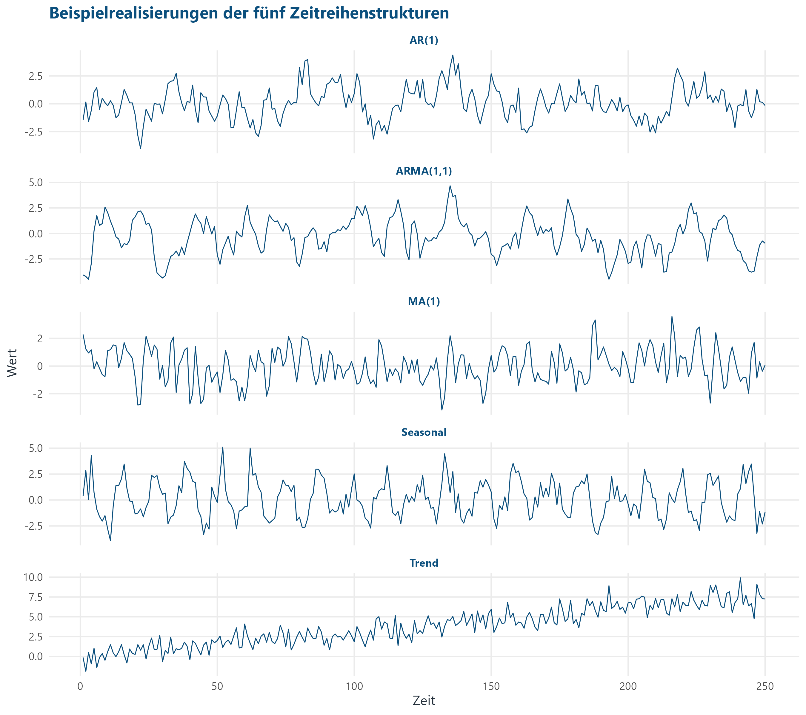
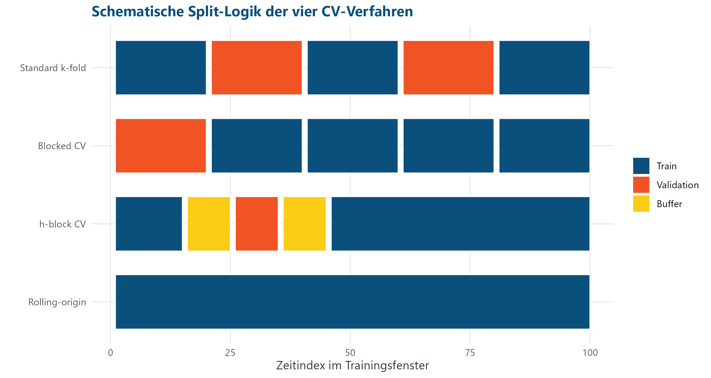
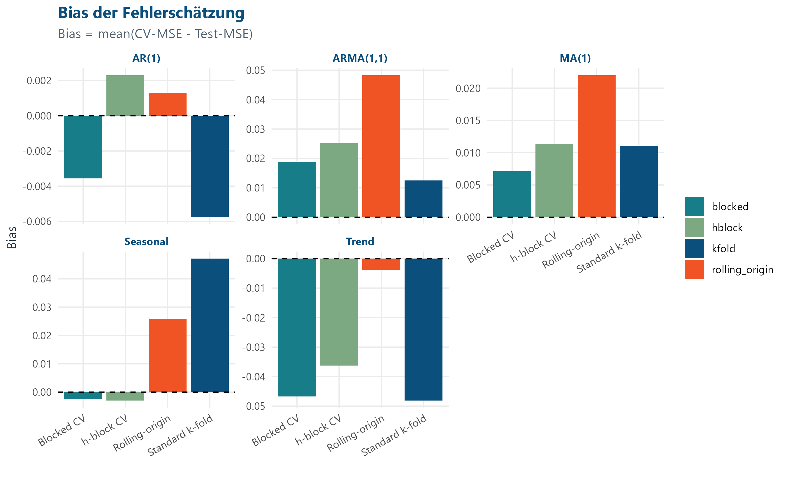
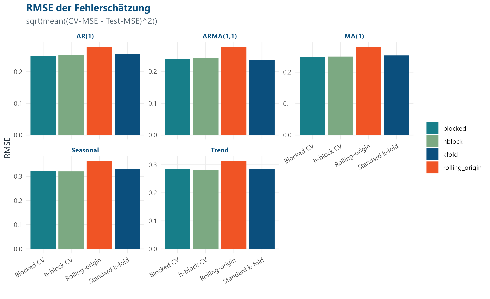
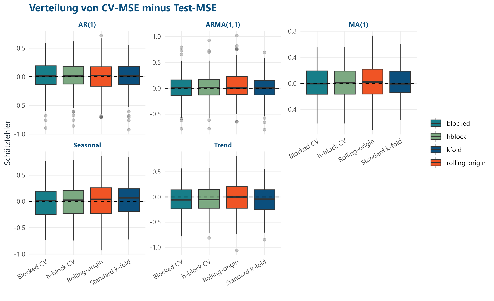
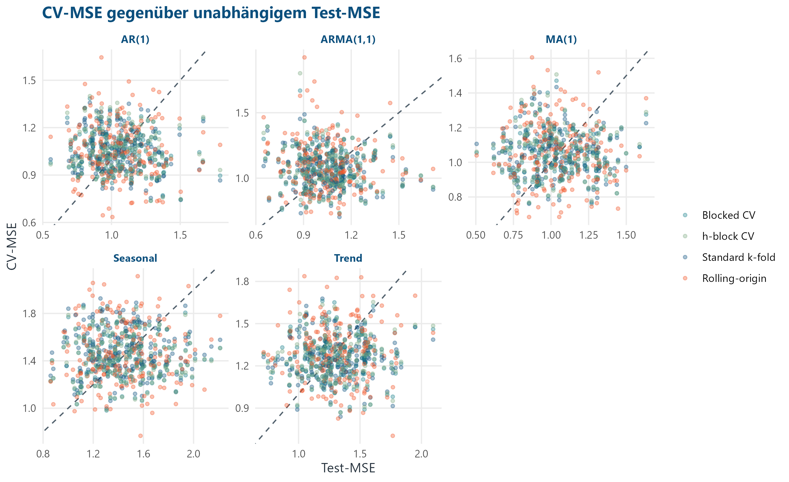
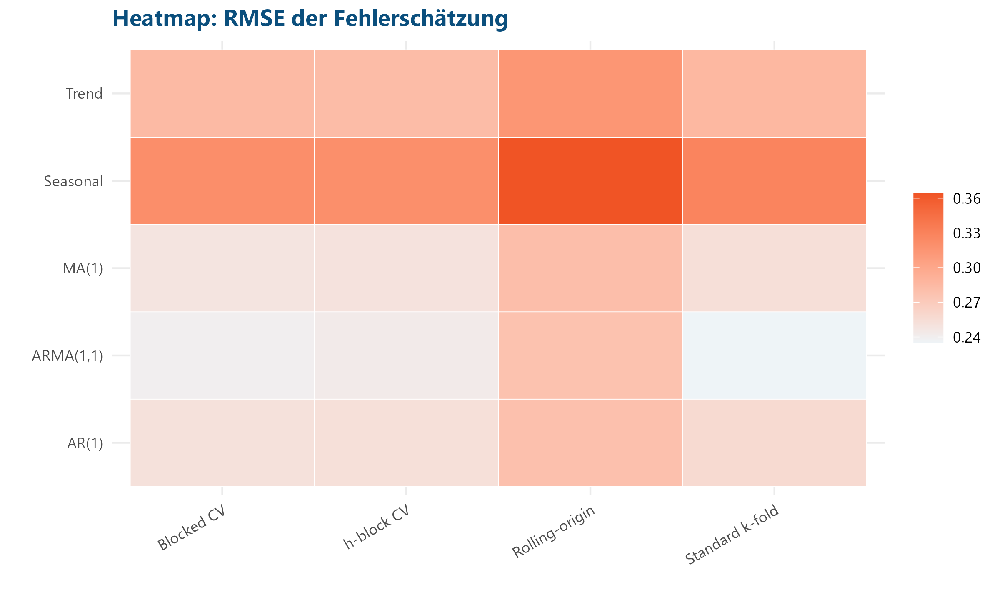
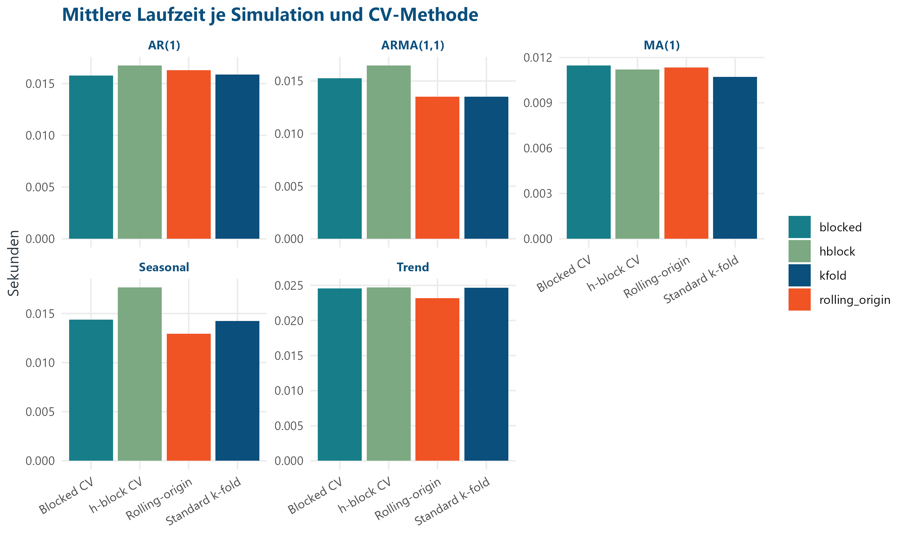

```{r}
if (dir.exists(".r-lib")) {
  .libPaths(c(normalizePath(".r-lib"), .libPaths()))
}
summary_table <- read.csv("../output/cv_comparison/tables/cv_method_summary.csv")
ranking <- read.csv("../output/cv_comparison/tables/cv_method_ranking.csv")
checks <- read.csv("../output/cv_comparison/tables/cv_validation_checks.csv")
run_info <- read.csv("../output/cv_comparison/tables/cv_run_info_final.csv")
case_metrics <- read.csv("../output/final_comparison/model_comparison_metrics.csv")
```

# Projekt in Kürze

In diesem Projekt untersuchen wir, wie gut vier Cross-Validation-Verfahren den späteren Prognosefehler bei Zeitreihen schätzen. Verglichen werden Standard-k-fold, blocked CV, h-block CV und rolling-origin CV auf fünf simulierten Zeitreihenstrukturen: AR(1), MA(1), ARMA(1,1), Trend und Seasonal.

Die zentrale Monte-Carlo-Studie verwendet `r run_info$repetitions_per_dgp` Wiederholungen pro DGP. Uns war wichtig, für alle CV-Verfahren dasselbe Modell zu verwenden. Dadurch können die Unterschiede besser auf die Validierungsmethode zurückgeführt werden.

::: {.callout-note}
Die Ridge-/Lasso-Analyse aus der früheren Projektfassung bleibt als zusätzliche ARMA(1,1)-Fallstudie erhalten. Sie ist Teil B, nicht die zentrale Forschungsfrage.
:::

# Forschungsfrage

> Wie unterscheiden sich Standard-k-fold-Cross-Validation, blocked Cross-Validation, h-block Cross-Validation und rolling-origin Cross-Validation bei AR-, MA-, ARMA-, Trend- und saisonalen Zeitreihen hinsichtlich der Schätzung des zukünftigen Prognosefehlers?

# Zentrale Konfiguration

Die wichtigsten Parameter stehen gesammelt in `syntax/project_config.R`. Das macht den Lauf nachvollziehbar: Zeitreihenlänge, Testfenster, Seeds, CV-Splits und DGP-Parameter werden nicht verstreut im Projekt gesetzt.

```{r}
knitr::kable(data.frame(
  Element = c("T", "Training", "Test", "Lags", "Modell", "CV-Splits", "h", "Wiederholungen pro DGP", "Seed"),
  Wert = c("250", "time 31-184", "time 185-250", "lag_1 bis lag_5", "Lineares Lag-Modell", "5", "5", run_info$repetitions_per_dgp, "20260716")
), caption = "Zentrale Konfiguration der Monte-Carlo-Studie.")
```

```{r}
#| echo: true
#| eval: false
#| code-fold: true
#| code-summary: "Code anzeigen: Originalzeilen aus syntax/project_config.R"
# Eine gemeinsame Seed-Basis macht die Simulation reproduzierbar.
seed = 20260716,

# Gemeinsame Zeitreihenlänge und Holdout-Design.
T = 250,
sigma = 1,
train_start = 31,
train_end = 184,
test_start = 185,
test_end = 250,

# Teil A: zentrale Monte-Carlo-CV-Studie.
primary_max_lag = 5,
primary_model_name = "LM-lag5",
cv_methods = c("kfold", "blocked", "hblock", "rolling_origin"),
dgp_names = c("AR(1)", "MA(1)", "ARMA(1,1)", "Trend", "Seasonal"),
n_mc_pilot = 5,
n_mc_final = 200,
n_cv_splits = 5,
h_block = 5,
burn_in = 100,

# Parameter der fünf datengenerierenden Prozesse.
ar_phi = 0.7,
ma_theta = 0.6,
arma_phi = 0.6,
arma_theta = 0.5,
trend_beta0 = 0,
trend_beta1 = 0.03,
seasonal_amplitude = 2,
seasonal_period = 12,
```

# Datengenerierende Prozesse

Die fünf Szenarien sind bewusst einfach gehalten. Sie sollen typische Zeitreihenstrukturen abdecken, ohne die Interpretation durch ein zu kompliziertes Modell zu verdecken.

- AR(1): \(y_t = 0.7 y_{t-1} + \varepsilon_t\)
- MA(1): \(y_t = \varepsilon_t + 0.6\varepsilon_{t-1}\)
- ARMA(1,1): \(y_t = 0.6y_{t-1} + \varepsilon_t + 0.5\varepsilon_{t-1}\)
- Trend: \(y_t = 0 + 0.03t + \varepsilon_t\)
- Seasonal: \(y_t = 2\sin(2\pi t / 12) + \varepsilon_t\)

Dabei gilt jeweils \(\varepsilon_t \sim \mathcal{N}(0,1)\). Für stationäre Prozesse wird eine Burn-in-Phase von 100 Beobachtungen verworfen.

```{r}
#| echo: true
#| eval: false
#| code-fold: true
#| code-summary: "Code anzeigen: Originalzeilen zur DGP-Simulation"
# AR(1): Der aktuelle Wert hängt vom direkten Vorgänger und neuem Rauschen ab.
y[i] <- phi * y[i - 1] + epsilon[i]

# MA(1): Der Prozess nutzt aktuelles und vorheriges Rauschen.
y[i] <- epsilon[i] + theta * epsilon[i - 1]

# ARMA(1,1): autoregressiver Teil plus Moving-Average-Teil.
y[i] <- phi * y[i - 1] + epsilon[i] + theta * epsilon[i - 1]

# Trend: deterministische lineare Entwicklung plus Zufallsfehler.
beta0 + beta1 * time + rnorm(T, mean = 0, sd = sigma)

# Seasonal: sinusfürmige Saisonkomponente mit Periode 12 plus Zufallsfehler.
amplitude * sin(2 * pi * time / period) + rnorm(T, mean = 0, sd = sigma)
```

{width="90%"}

# Lag-Features und einheitliches Modell

Teil A verwendet für alle DGPs und alle CV-Methoden dasselbe Prognosemodell: eine lineare Regression von `y` auf `lag_1` bis `lag_5`. Es gibt hier keine Modellselektion und keine Lambda-Optimierung. Der Vergleich soll die CV-Verfahren treffen, nicht verschiedene Modellklassen.

```{r}
#| echo: true
#| eval: false
#| code-fold: true
#| code-summary: "Code anzeigen: Originalzeilen zur Lag-Bildung und ModellSchätzung"
# für jeden Lag wird eine eigene Spalte erzeugt.
# lag_1 enthält y_{t-1}, lag_2 enthält y_{t-2} usw.
für (lag in 1:max_lag) {
  data[[paste0("lag_", lag)]] <- c(
    rep(NA, lag),
    y[1:(length(y) - lag)]
  )
}

# Nach der Lag-Bildung werden unvollständige Anfangszeilen entfernt.
data <- na.omit(data)

# Das finale Modell nutzt alle Lags von 1 bis primary_max_lag.
required_lags <- paste0("lag_", seq_len(max_lag))
fürmula <- as.fürmula(paste("y ~", paste(required_lags, collapse = " + ")))
lm(fürmula, data = train_data)
```

# unabhängiger zukünftiger Testzeitraum

Nach der Lag-Erstellung werden die Zeitpunkte 31 bis 184 als Training und 185 bis 250 als unabhängiger Testzeitraum verwendet. Jede CV-Methode arbeitet ausschließlich innerhalb des Trainingszeitraums. Der Test-MSE bleibt die Referenz für den späteren Prognosefehler.

```{r}
#| echo: true
#| eval: false
#| code-fold: true
#| code-summary: "Code anzeigen: Originalzeilen zur Train-Test-Trennung"
# Die Lags werden zuerst erzeugt, damit Training und Test dieselbe Feature-Struktur haben.
lag_data <- create_lags(y = y, max_lag = config$primary_max_lag)

# Alle CV-Verfahren bekommen nur diesen Trainingsausschnitt.
train_data <- lag_data[
  lag_data$time >= config$train_start & lag_data$time <= config$train_end,
]

# Dieser spätere Abschnitt wird nicht für CV verwendet.
test_data <- lag_data[
  lag_data$time >= config$test_start & lag_data$time <= config$test_end,
]

# Der Testfehler ist die externe ReferenzGröße für die CV-Schätzung.
final_model <- fit_primary_model(train_data, config)
test_predictions <- predict_model(final_model, test_data)
test_mse <- mse(test_data$y, test_predictions)
```

# Cross-Validation-Verfahren

{width="90%"}

## Standard-k-fold

Standard-k-fold verteilt die Trainingsbeobachtungen zufällig auf fünf Folds. Die Zeitstruktur wird bewusst ignoriert. Die Methode dient als klassische Referenz, ist aber für Zeitreihen methodisch problematisch.

```{r}
#| echo: true
#| eval: false
#| code-fold: true
#| code-summary: "Code anzeigen: Originalzeilen zu k-fold"
# Der Seed sorgt dafür, dass dieselbe Simulation dieselbe Fold-Zuordnung bekommt.
set.seed(seed)
fold_id <- sample(rep(seq_len(k), length.out = n))

# Ein Fold wird validiert, alle anderen Beobachtungen dienen als Training.
validation_index <- which(fold_id == fold)
train_index <- which(fold_id != fold)

# Diese Kennzeichnung macht später sichtbar: k-fold nutzt die Zeitrichtung nicht.
validation_contiguous = FALSE,
uses_future_training = TRUE,
```

## Blocked CV

Blocked CV verwendet zusammenhängende Validierungsblöcke. Dadurch bleibt der Validierungsblock zeitlich geordnet, aber das Training kann weiterhin Beobachtungen aus der Zukunft enthalten.

```{r}
#| echo: true
#| eval: false
#| code-fold: true
#| code-summary: "Code anzeigen: Originalzeilen zu blocked CV"
# Die Trainingsreihe wird in zusammenhängende Blöcke geteilt.
folds <- make_contiguous_folds(nrow(data), k)
validation_index <- folds[[fold]]
train_index <- setdiff(seq_len(nrow(data)), validation_index)

# Der Check dokumentiert, ob spätere Zeitpunkte im Training liegen.
validation_contiguous = TRUE,
uses_future_training = max(data$time[train_index]) > max(data$time[validation_index]),
```

## h-block CV

h-block CV nutzt ebenfalls zusammenhängende Validierungsblöcke, entfernt aber zusätzlich `h = 5` Beobachtungen vor und nach dem Validierungsblock. Dadurch wird lokale zeitliche Nähe reduziert.

```{r}
#| echo: true
#| eval: false
#| code-fold: true
#| code-summary: "Code anzeigen: Originalzeilen zu h-block CV"
# h kommt direkt aus der zentralen Konfiguration.
h <- config$h_block

# Um den Validierungsblock wird ein Puffer entfernt.
buffür_start <- max(1, min(validation_index) - h)
buffür_end <- min(nrow(data), max(validation_index) + h)
removed_index <- buffür_start:buffür_end
train_index <- setdiff(seq_len(nrow(data)), removed_index)

# Die entfernten Zeiten werden gespeichert, damit der Puffer prüfbar bleibt.
removed_time_min = min(buffür_times),
removed_time_max = max(buffür_times)
```

## Rolling-origin CV

Rolling-origin verwendet ein expandierendes Trainingsfenster. Jeder Validierungsblock liegt vollständig nach dem Trainingsfenster. Diese Methode ist zeitlich sauber, erzeugt in diesem Design aber weniger Validierungsvorhersagen.

```{r}
#| echo: true
#| eval: false
#| code-fold: true
#| code-summary: "Code anzeigen: Originalzeilen zu rolling-origin CV"
# Das erste Trainingsfenster umfasst die Hälfte der Trainingsdaten.
initial_train_size <- floor(0.5 * n)
validation_size <- ceiling((n - initial_train_size) / k)

# Der Validierungsblock beginnt direkt nach dem aktuellen Trainingsende.
validation_start <- train_end + 1
validation_end <- min(train_end + validation_size, n)
train_index <- seq_len(train_end)
validation_index <- validation_start:validation_end

# Dieser Sicherheitscheck verhindert Training auf zukünftigen Beobachtungen.
if (max(train_index) >= min(validation_index)) {
  stop("Rolling-origin verletzt die Zeitrichtung in Split ", fold)
}
```

# Bewertungskennzahlen

Die zentrale Größe ist

\[
\text{estimation error} = \text{CV-MSE} - \text{Test-MSE}.
\]

Negative Werte bedeuten eine optimistische Schätzung, positive Werte eine pessimistische Schätzung. Ausgewertet werden Bias, Varianz, RMSE und MAE des Schätzfehlers, der Anteil optimistischer Schätzungen, die Standardabweichung des CV-MSE und die Laufzeit.

```{r}
#| echo: true
#| eval: false
#| code-fold: true
#| code-summary: "Code anzeigen: Originalzeilen zu Fehlermaßen und Kennzahlen"
# MSE ist die gemeinsame Fehlerfunktion für CV und Test.
mse <- function(actual, predicted) {
  mean((actual - predicted)^2)
}

# Der Schätzfehler vergleicht CV-Schätzung mit unabhängigem Testfehler.
estimation_error <- cv_result$cv_mse - test_mse
squared_estimation_error = estimation_error^2,
absolute_estimation_error = abs(estimation_error),

# Über alle Monte-Carlo-Wiederholungen werden Bias und weitere Kennzahlen gemittelt.
summary_table <- aggregate(
  cbind(cv_mse, test_mse, estimation_error, squared_estimation_error,
        absolute_estimation_error, runtime_seconds) ~ dgp + cv_method,
  data = successful,
  FUN = mean
)
summary_table$rmse_estimation_error <- sqrt(summary_table$mean_squared_estimation_error)
summary_table$abs_bias <- abs(summary_table$bias)
```

# Monte-Carlo-Lauf

In jeder Wiederholung wird pro DGP eine neue Zeitreihe simuliert. Danach laufen alle vier CV-Methoden über dieselben Trainingsdaten. Die Ergebnisse, Splits und Validierungsvorhersagen werden getrennt gespeichert.

```{r}
#| echo: true
#| eval: false
#| code-fold: true
#| code-summary: "Code anzeigen: Originalzeilen zur Monte-Carlo-Schleife"
# Jede Kombination aus DGP und Wiederholung wird systematisch durchlaufen.
für (dgp_name in config$dgp_names) {
  für (simulation_id in seq_len(R)) {
    message("CV-MC ", run_label, " | DGP: ", dgp_name, " | Simulation: ", simulation_id, "/", R)
    one <- run_one_cv_simulation(simulation_id, dgp_name, config)
    all_results <- rbind(all_results, one$results)
    all_splits <- rbind(all_splits, one$splits)
    all_predictions <- rbind(all_predictions, one$predictions)
  }
}

# Der finale Lauf schreibt die kanonischen Ergebnisdateien ohne Zusatzsuffix.
write.csv(all_results, file.path(raw_dir, "cv_simulation_results.csv"), row.names = FALSE)
write.csv(all_splits, file.path(raw_dir, "cv_split_definitions.csv"), row.names = FALSE)
write.csv(all_predictions, file.path(raw_dir, "cv_validation_predictions.csv"), row.names = FALSE)
```

# Monte-Carlo-Ergebnisse

```{r}
display_summary <- summary_table[, c("dgp", "cv_method", "bias", "rmse_estimation_error", "var_estimation_error", "optimistic_share", "mean_runtime_seconds")]
display_summary[, 3:7] <- round(display_summary[, 3:7], 4)
knitr::kable(display_summary, caption = "Zentrale Kennzahlen nach DGP und CV-Methode.")
```

{width="92%"}

{width="92%"}

{width="92%"}

# Vergleich nach Zeitreihenstruktur

```{r}
knitr::kable(ranking, caption = "Beste Methode je DGP und Kriterium.")
```

Bei AR(1) hat rolling-origin den kleinsten absoluten Bias, während blocked CV den kleinsten RMSE und die kleinste Varianz des Schätzfehlers besitzt. Bei ARMA(1,1) liegt Standard-k-fold in diesem einfachen linearen Setting nach Bias, RMSE und Varianz vorn. Bei MA(1) ist blocked CV in allen drei Genauigkeitskriterien am stärksten. für die saisonale Zeitreihe zeigt sich dagegen: blocked CV liegt beim Bias vorn, h-block aber bei RMSE und Varianz. Bei Trenddaten reduziert rolling-origin den Bias am stärksten, h-block den RMSE.

{width="92%"}

{width="80%"}

# Rechenaufwand

{width="92%"}

Die mittleren Laufzeiten unterscheiden sich in diesem linearen Setup nur wenig. Rolling-origin ist oft schnell, weil es weniger Validierungsvorhersagen erzeugt. Dieser Vorteil ist methodisch nicht kostenlos: Die Schätzung basiert auf weniger Validierungspunkten.

# Zentrale Interpretation

Es gibt keine universell beste CV-Methode. Die Rangfolge hängt vom DGP und vom Kriterium ab. Standard-k-fold ist theoretisch bei Zeitreihen problematisch, kann aber in einfachen stationären linearen Szenarien nahe am Testfehler liegen. Blocked CV ist in mehreren DGPs stabil, erlaubt aber Zukunft im Training. h-block reduziert lokale Nähe und verbessert vor allem beim saisonalen DGP RMSE und Varianz gegenüber blocked. Rolling-origin ist zeitlich sauber und besonders plausibel bei Trenddaten, zeigt aber wegen weniger Validierungspunkte eine höhere Streuung.

# Zusätzliche ARMA-Fallstudie mit OLS, Ridge und Lasso

Als Teil B wird untersucht, ob Regularisierung bei einem ARMA(1,1)-Prozess mit 30 korrelierten Lag-Prädiktoren die Prognose verbessert. Diese Analyse vergleicht naive baseline, OLS Lag 1, OLS Lag 30, Ridge Lag 30 und Lasso Lag 30.

```{r}
case_display <- case_metrics[, c("model", "cv_mse", "test_rmse", "test_mae")]
case_display[, 2:4] <- round(case_display[, 2:4], 4)
knitr::kable(case_display, caption = "Sekundäre ARMA(1,1)-Fallstudie.")
```

Diese Fallstudie beantwortet eine andere, engere Unterfrage. Sie wird nicht mit den Monte-Carlo-Ergebnissen vermischt.

# Reproduzierbarkeit und Checks

Die automatischen Checks prüfen unter anderem, ob alle erwarteten Ergebniszeilen vorhanden sind, ob alle DGPs und CV-Methoden vorkommen, ob keine Testdaten in der CV liegen und ob rolling-origin wirklich keine zukünftigen Trainingswerte verwendet.

```{r}
#| echo: true
#| eval: false
#| code-fold: true
#| code-summary: "Code anzeigen: Originalzeilen zu Validierungschecks"
# Die CV darf nie in den unabhängigen Testzeitraum hineinvalidieren.
checks <- add_check(checks, "no_test_data_in_cv", max(splits$validation_time_max, na.rm = TRUE) < config$test_start, paste("max_cv_time=", max(splits$validation_time_max, na.rm = TRUE)))

# Rolling-origin muss strikt Vergangenheit vor Zukunft einhalten.
rolling <- splits[splits$cv_method == "rolling_origin", ]
checks <- add_check(checks, "rolling_origin_uses_no_future_training", all(!rolling$uses_future_training & rolling$train_time_max < rolling$validation_time_min), "train max < validation min")

# Beim h-block wird geprüft, ob der konfigurierte Puffer wirklich entfernt wurde.
hblock <- splits[splits$cv_method == "hblock", ]
expected_removed_min <- pmax(config$train_start, hblock$validation_time_min - config$h_block)
expected_removed_max <- pmin(config$train_end, hblock$validation_time_max + config$h_block)
checks <- add_check(checks, "hblock_removes_configured_buffür", all(hblock$h == config$h_block & hblock$removed_time_min == expected_removed_min & hblock$removed_time_max == expected_removed_max), paste("h=", config$h_block))
```

Alle finalen Checks sind bestanden:

```{r}
knitr::kable(checks, caption = "Automatische Validierungschecks.")
```

Der vollständige Lauf ist:

```bash
Rscript syntax/99_run_all.R
```

Die wichtigsten Outputs liegen unter `output/cv_comparison/`.

# Limitationen

Die Studie nutzt einfache lineare Lag-Modelle und simulierte DGPs. Die Ergebnisse zeigen methodische Unterschiede in einem kontrollierten Setting, aber sie sind keine Garantie für reale, nichtlineare oder strukturell brechende Zeitreihen. Außerdem verwendet rolling-origin weniger Validierungsvorhersagen als die anderen Methoden; das ist methodisch transparent, beeinflusst aber Streuung und Laufzeitvergleich.
